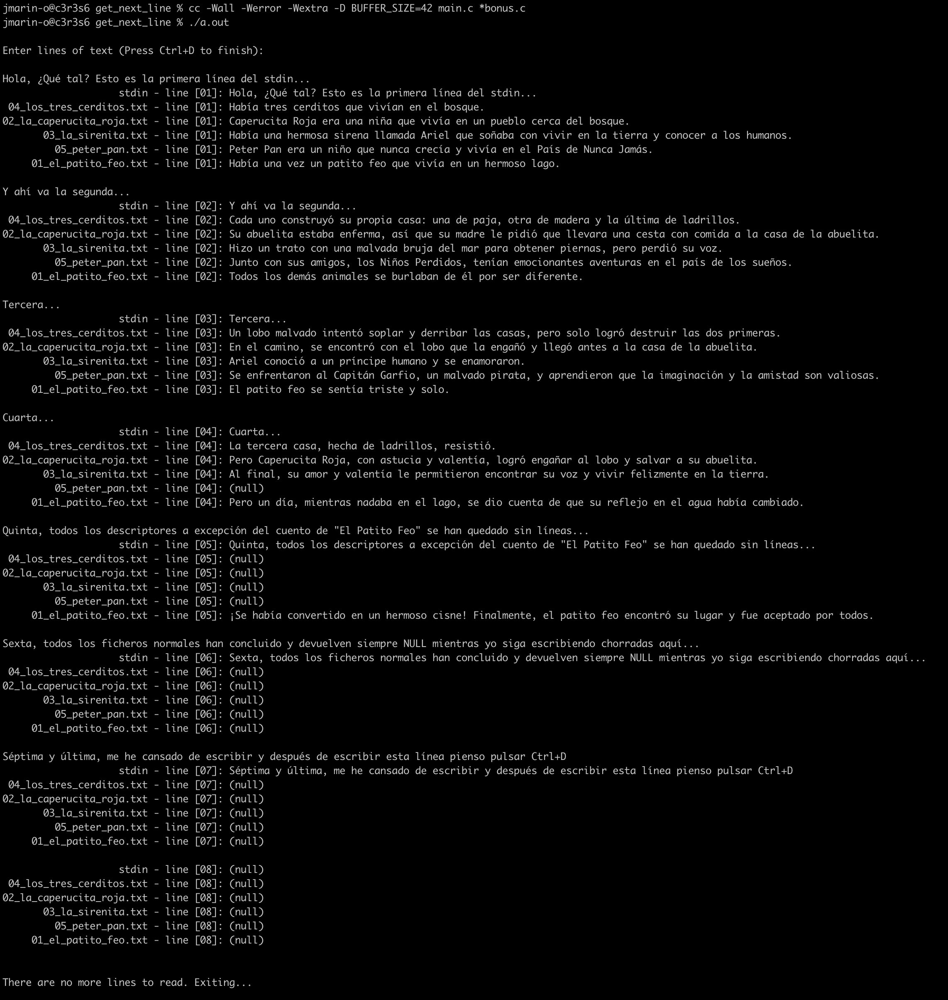
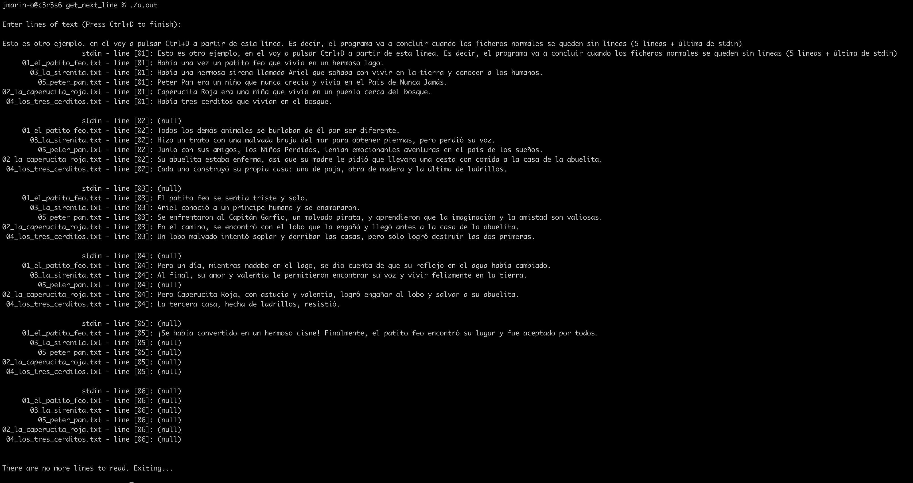

# RECURSOS ÚTILES PARA ESTUDIANTES DE `42 NETWORK`
Desde aquí tendrás acceso a un listado de recursos que pueden serte de mucha
utilidad en tu aventura durante el `Cursus` y el `Common Core`. En este listado
de utilidades encontrarás desde scripts en `Shell` hasta main's que te servirán
para probar y validar tus propios proyectos.

## MAIN's
- [Main para Get Next Line](./mains/main_get_next_line.c)

	*Ejemplo de uso:*
	```bash
	# Primero nos clonamos este proyecto para tener el main necesario
	cd ~/

	git clone https://github.com/jmarin-mlg/resources_42_malaga.git

	# Después clonamos mi proyecto GNL o bien utiliza tu propio proyecto GNL
	git clone https://github.com/jmarin-mlg/get_next_line.git

	cd ~/get_next_line/improved_version/

	# Copiamos el main a nuestra carpeta de GNL
	cp ~/resources_42_malaga/mains/main_get_next_line.c .

	# Editamos el fichero para modificar las líneas 18 y 21, que corresponden
	# a los PATH's de la librería y los textos
	vim main_get_next_line.c

	# Línea 18: #include "get_next_line_bonus.h"
	# Línea 21: #define PATH_TEXTS "../../resources_42_malaga/texts"

	# Por último compila el programa y ejecútalo
	cc -Wall -Werror -Wextra -D BUFFER_SIZE=42 main_get_next_line.c *bonus.c
	./a.out

	# También admite argumentos
	./a.out ../../resources_42_malaga/texts/08_more_2k.txt ../../resources_42_malaga/texts/03_la_sirenita.txt

	# Si lo prefieres, puedes testear los leaks de memoria y ejecutar el
	# programa en un solo proceso (siempre y cuando estes en 42 Network)
	../../resources_42_malaga/scripts/checkleaks
	```
	*Capturas de la ejecución:*
	<table>
	<tr>
		<td></td>
		<td></td>
	</tr>
	</table>

## SCRIPT's
- [Script shell - Chequea leaks en C](./scripts/checkleaks):

	¡ATENCIÓN! Este script solamente funcionará en los clusters de `42 Network`,
	debido a que utiliza el comando `leaks` que no es nativo. Si quisieras
	estandarizar este script deberías sustituir ese comando por `valgrind` o
	cualquiera otra utilidad para rastrear perdidas de memoria.

	*Ejemplo de uso:*
	```bash
	# Recuerda darle permisos de ejecución a tu script
	chmod +x checkleaks

	# Si el main puede incluir argumentos añadelos en la ejecución de este script
	./checkleaks 01_el_patito_feo.txt 03_la_sirenita.txt 05_peter_pan.txt

	# Si tu main no requiere argumentos o estos pueden ser opcionales
	./checkleaks
	```

	Una vez ejecutado, el script te solicitará los ficheros de **C** que quieres
	compilar, así como también los `flags` y `constantes` que quieras añadir a
	esta compilación.
